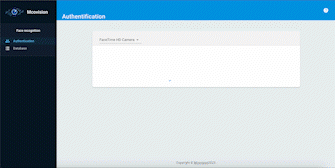
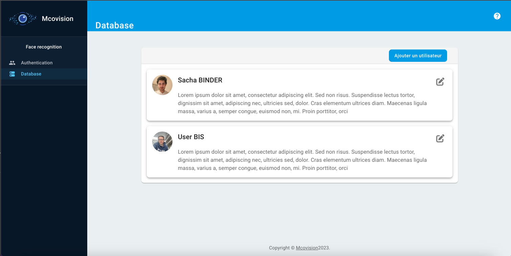

# Facial recognition web app

:pushpin: This repository is for the moment only for dev, **please do not put this version in production**.

This project is a facial recognition app. It detects in real time faces present in a database on a live stream from the webcam. The good point of the [MVC architechture](https://en.wikipedia.org/wiki/Model%E2%80%93view%E2%80%93controller) implemented is that this facial recognition framework can be implemented in all type of device by using API endpoints.

<p align="center">
    </a>
    </a>
</p>

* Back-end : [django](https://www.djangoproject.com/) + [django REST Framework](https://www.django-rest-framework.org/)
* Front-end : [ReactJS](https://reactjs.org/)
* Database : [PostgreSQL](https://www.postgresql.org/)

[Face recognition](https://sefiks.com/2018/08/06/deep-face-recognition-with-keras/) framework is adapted from [DeepFace](https://github.com/serengil/deepface/tree/master). It is a hybrid face recognition framework wrapping **state-of-the-art** models: [`VGG-Face`](https://sefiks.com/2018/08/06/deep-face-recognition-with-keras/), [`Google FaceNet`](https://sefiks.com/2018/09/03/face-recognition-with-facenet-in-keras/), [`OpenFace`](https://sefiks.com/2019/07/21/face-recognition-with-openface-in-keras/), [`Facebook DeepFace`](https://sefiks.com/2020/02/17/face-recognition-with-facebook-deepface-in-keras/), [`DeepID`](https://sefiks.com/2020/06/16/face-recognition-with-deepid-in-keras/), [`ArcFace`](https://sefiks.com/2020/12/14/deep-face-recognition-with-arcface-in-keras-and-python/), [`Dlib`](https://sefiks.com/2020/07/11/face-recognition-with-dlib-in-python/) and `SFace`.

The model to be used as well as the distancing method can be directly selected from the file [settings.py](/back/back/settings.py#L174-L176)

## Installation of app

### Download the project

First, clone the project by executing :
```bash
git clone git@github.com:sachabinder/faceRecognition.git
```

then, you can access the repository folder on your local machine by executing :
```bash
cd faceRecognition
```

You are now ready to go !

---

:warning: **WARNING** : Before playing with docker, if you are on ARM architecture (Apple chips), please uncomment [this line](/back/pyproject.toml#L16) :warning:

### Build and up the project

To build docker images of containers you should run :
```bash
docker-compose build
```

To run the app on local machine you should run :
```bash
docker-compose up
```

:information_source: PLEASE WAIT THE COMPLETE STARTING OF THE SERVICES, it shoud take few minutes. In fact, front can take some time to build and back should dowload model weights. Everthing is started when you see :
```bash
facerecognition-front-1  | webpack 5.75.0 compiled successfully in 6159 ms
facerecognition-back-1   | Watching for file changes with StatReloader
facerecognition-back-1   | Performing system checks...
facerecognition-back-1   | 
facerecognition-back-1   | System check identified no issues (0 silenced).
facerecognition-back-1   | March 06, 2023 - 23:14:51
facerecognition-back-1   | Django version 4.1.2, using settings 'back.settings'
facerecognition-back-1   | Starting development server at http://0.0.0.0:8000/
facerecognition-back-1   | Quit the server with CONTROL-C.
```

You can now access the app (on port 8000 for the back and 8080 for the front which can be change in [env file](.env)) by :
* [localhost:8000](localhost:8000) for the REST api
* [localhost:8000/admin](localhost:8000/admin) for the django admin
* [localhost:8080](localhost:8080) for the web app


## Access to database

You can access to the PostgreSQL database shell (in the assigned docker container) by running :
```bash
docker exec -it $(docker ps -f 'name=db' --format '{{.ID}}') psql -U name
```


## Operate on the back-end

You can access the prompt of back-end docker container by running :
```bash
docker-compose exec back /bin/bash
```

### django tips

To create a super user from the back-end, you should run :
```bash
python manage.py createsuperuser
```

To create migration from the back-end (TO BE DONE AFTER MODEL MODIFICATIONS), you should run :
```bash
python manage.py makemigrations
```

To execute migrations, you shoud run (automaticly done at container starting) :
```bash
python manage.py migrate
```


### Add a Python dependancy (Backend)

To manage dependancy on the backend, we are using [poetry](https://python-poetry.org/). To add a Python module, you should add it on [pyproject file](/back/pyproject.toml) and then re-build Docker containers.


## Operate on the front-end

You can access the shell of front-end docker container by running :
```bash
docker-compose exec front /bin/sh
```

### NPM server

To start/restart the webpack dev server, run on the container :
```bash
/usr/local/bin/npm run dev
```


### Add a Node dependancy

To manage dependancy on the frontend, we are using [npmJS](https://www.npmjs.com/). To add a Node module, you should add it on [package.json](/front/package.json) and then re-build the back Docker container.

You can also execute in the front-end container :
```bash
/usr/local/bin/npm install [your-package-name] -D
```
Then, the [package.json](/front/package.json) will be automatically update.


### Front Linting

If you want to test the linting of your file before pushing it on the repo, you can install the eslint extension in VS Code, or just use the following lines if you have previously installed npm and the eslint dependency:
```bash
npm run lint 
```
and if you think the errors can be corrected directly by the linter without problem:

```bash
npm run lint:fix
```


## Environment

| Variable | Description | Dev value |
|-----------------------|---------------------------------------------------------------------------------------------------------------------------------------|------------------|
| DB_HOST | Host name of the db | db |
| DB_PORT | Port of the DB (in container). | 5432 |
| DB_USER | User of the DB | user |
| DB_NAME | Name of the DB | name |
| DB_PASSWORD | Password of the DB | password |
| BACK_PORT | External back port access | 8000 |
| FRONT_PORT | External front port access | 8080 |
| DEBUG | Debug mode execution | True |
| DOMAIN_NAME | Domaine name to use. Requests from other domain will be rejected. | 127.0.0.1 |
| SECURE_SSL_REDIRECT | Automaticly redirect non HTTPS requests in HTTPS. To be leave at False if an other proxy is already doing this work | False |


Command to run to generate a secret django key (you should get django installed)

```bash
python3 -c 'from django.core.management.utils import get_random_secret_key; print(get_random_secret_key())'
```
